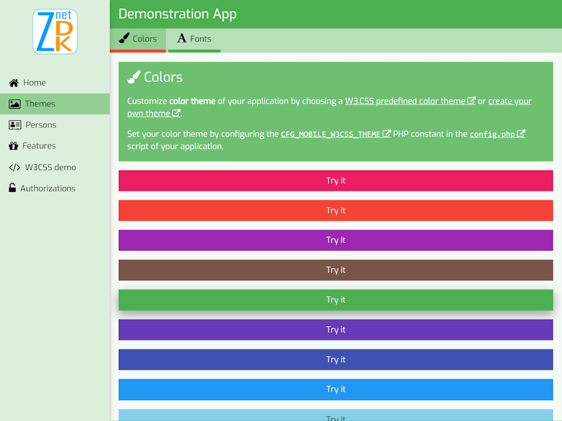

# ZnetDK for Mobile Demo
This repository hosts the source code of the demo application published at (https://mobile.znetdk.fr/demo).

## Requirements
[ZnetDK 4 Mobile](https://github.com/pascal-martinez/znetdk4mobile) is installed.
> Go to the page [Getting Started](https://mobile.znetdk.fr/getting-started) to install ZnetDK 4 Mobile.

## Installation
1. Download the **ZIP archive** of the Demo App from this GitHub repository: [znetdk4mobile-demo ZIP archive](https://github.com/pascal-martinez/znetdk4mobile-demo/archive/refs/heads/master.zip).
1. Empty the `INSTALL_DIR/applications/default/` subfolder.
1. Unzip the downloaded ZIP archive content within the new `INSTALL_DIR/applications/default/` subfolder.

## Running the Demo App
Once the installation is done, open your web browser and enter in the address bar, the URL of the Demo Application.

> For example: `http://localhost/znetdk4mobile-demo/index.php`

